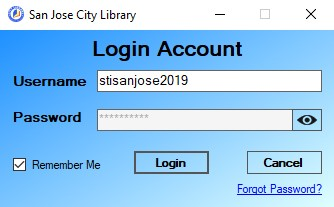

# San Jose City Library System

A library system specifically made to meet the requirements of the San Jose City Library with the objective in entirely replacing the old library system with updated UI and additional functionalities.

## Features

- Login
- Account Type Function Limit
- Activity Log
- Multiple Variable Auto Fee Calculation
- Reports
- Create and Restore Backup
## Preview

More Preview

